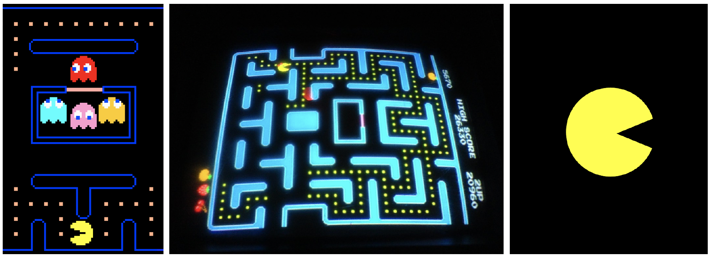
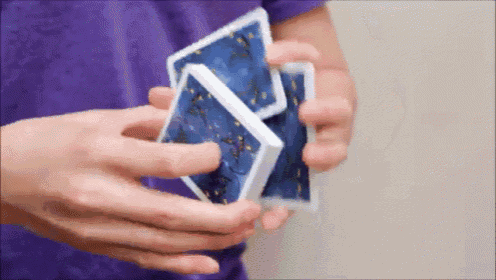

SUPSI 2022-23  
Corso d’interaction design, CV427.01  
Docenti: A. Gysin, G. Profeta  

Elaborato 1: Marionetta digitale  

# Fake Pacman
Autore: Sofia Nunnari  
[MediaPipe demo-ES6](https://ixd-supsi.github.io/2023/esempi/mp_hands/es6/1_landmarks)


## Tema affrontato
Il progetto affronta il sistema di interfaccia per la generazione di marionette in realtà aumentata applicate sulla mano, con l’obiettivo di creare una marionetta che si estenda sull’intera mano o in parte, rappresentando graficamente un personaggio con un proprio carattere. Con la fotocamera del computer che cattura e riconosce le mani per il tracciamento e il disegno della marionetta, insieme alla tecnologia “Media Pipe” (e p5js) per creare marionette digitali interattive. Il sistema di interfaccia sviluppato è stato progettato per essere intuitivo e facile da usare anche per gli utenti non esperti, offrendo una nuova esperienza interattiva.Il mio progetto, chiamato Fake-Pacman, è un omaggio al gioco originale. Tuttavia, a differenza del Pacman originale, il personaggio non si trova in un labirinto, il che giustifica l’attributo “fake”.


## Riferimenti progettuali
Per la progettazione della mia marionetta, ho deciso di utilizzare Pac-Man come riferimentoprogettuale perché volevo creare un personaggio altrettanto accattivante e facileda riconoscere. Per il design della marionetta ho utilizzato la classica forma arrotondata,proprio come al design originale (non pixelato). Grazie a questo riferimento progettuale,la mia marionetta si distingue per il suo stile originale e riconosciutoCuriosità: Il gioco di Pac-Man è stato creato da Toru Iwatani, un designer di videogiochigiapponese, e fu pubblicato dalla Namco in Giappone nel maggio del 1980.

[]()


## Design dell’interfraccia e modalià di interazione
Ho progettato l’interfaccia e la modalità di interazione per la marionetta, il codice cattura le punte delle dita del pollice e dell’indice per controllare l’apertura e la chiusura della bocca del personaggio, rendendo l’esperienza di interazione con la marionetta intuitiva e naturale per l’utente. Per aumentare il coinvolgimento dell’utente, ho incluso una funzione di generazione di puntini premendo la barra spaziatrice, che possono essere mangiati dalla marionetta. L’interfaccia è stata progettata in modo chiaro e facile da comprendere, con l’aggiunta di un pulsante per guidare l’utente durante l’utilizzo della marionetta su come funziona.

[]()


## Tecnologia usata
La tecnologia utilizzata per la realizzazione della marionetta si basa su diverse funzionie algoritmi, tra cui l’utilizzo di sensori di movimento e la visualizzazione in tempo reale.Ho utilizzato una funzione per creare il canvas, dei pallini da generare all’interno delcanvas premendo la barra spaziatrice, una funzione per disegnare la marionetta (ovveroil pacman), e che riconoscesse la mano destra e quella sinistra per spostare l’orientamentodella marionetta. In particolare, l’interazione con la marionetta avviene tramitegesti e movimenti naturali, che permettono di muovere il personaggio e di interagire congli oggetti presenti (i pallini) nell’ambiente virtuale.Ho utilizzato uno sfondo blu scuro e l’uso di un font pixelato (Lores-12) per richiamare unostile vintage del videogame. Ho aggiunto un allert che spiega come funziona il gioco.


```JavaScript
function drawPacman(x, y, size, angle, flip) {
	const mouthSize = size * 0.5;

	noStroke();
	fill(255, 255, 0); // colore giallo per il corpo di Pacman

	angle = min(angle, 90);

	const a2 = radians(angle / 2)

	if (flip) {
		arc(x, y, size, size, a2, TAU - a2, PIE);
	} else {
		arc(x, y, size, size, PI + a2, PI - a2, PIE);
	}
}
```
Funzione per disegnare il pacman


```JavaScript
function keyPressed() {
	if (keyCode === 32) {
		let newPallino = new Pallino();
		pallini.push(newPallino);
	}
}
class Pallino {
	constructor() {
		this.x = random(width);
		this.y = random(height);
		this.r = 10
	}

	display() {
		fill(255);
		ellipse(this.x, this.y, this.r * 2, this.r * 2)
	}

	collide(x, y, r) {
		const distCentri = dist(x, y, this.x, this.y);
		const sommaRaggi = this.r + r; // raggio della bocca
		if (distCentri < sommaRaggi) {
			// Incrementa il punteggio e rimuovi il pallino
			punteggio++;
			return true;
		} else {
			return false;
		}
	}

}

```
Funzioni per generare i pallini + la sparizione del pallino una
volta mangiato (con l’incrementazione di un punto)


```JavaScript
async function draw() {
	background('#00095B');

	for (let i = 0; i < pallini.length; i++) {
		pallini[i].display();
	}

	// Visualizza il punteggio
	textSize(32);
	fill(255);
	text("Punteggio: " + punteggio, 10, 30);


```
Funzione per disegnare il canvas più tutte le altre sottostrutture
(conteggio dei punti, interpolazione “smooth”, ecc...)


## Target e contesto d’uso
Il target principale è costituito per gli amanti dei videogiochi, indipendentemente dall’età. Il contesto d’uso ideale per la marionetta potrebbe essere per essere utilizzata in contesti di intrattenimento interattivo, come ad esempio fiere del gioco o eventi simili. Grazie alla sua interfaccia intuitiva e alla modalità di interazione semplice ma coinvolgente, la marionetta può catturare l’attenzione del pubblico e intrattenerlo.

https://user-images.githubusercontent.com/6561331/236182302-68a6bd12-7b83-4d19-b83e-c9b7db795881.mp4

## Link al progetto su GitHub
<a href ="https://sofinari.github.io/fake_pacman/">https://sofinari.github.io/fake_pacman/</a>